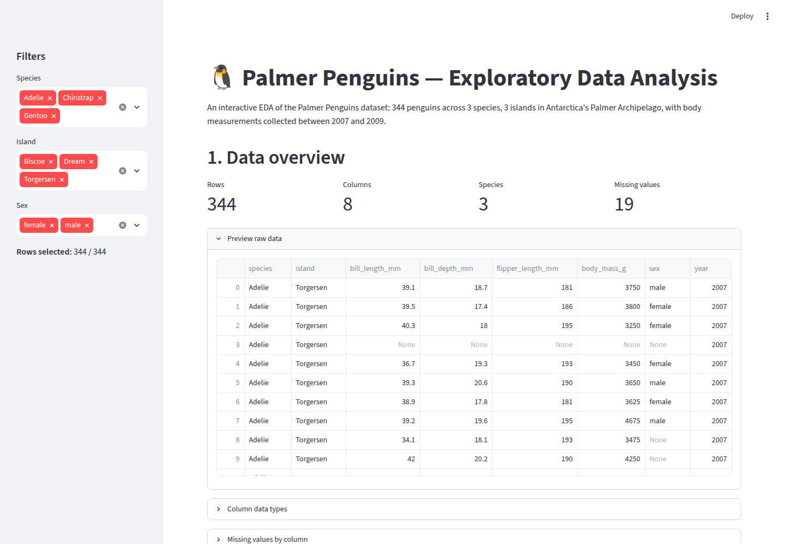
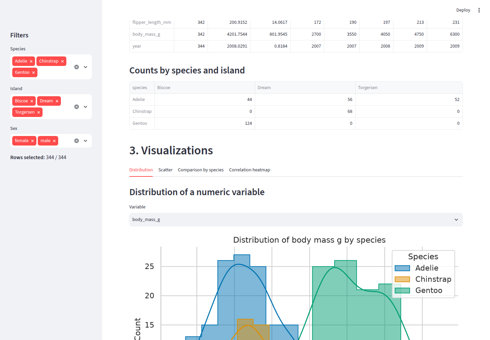
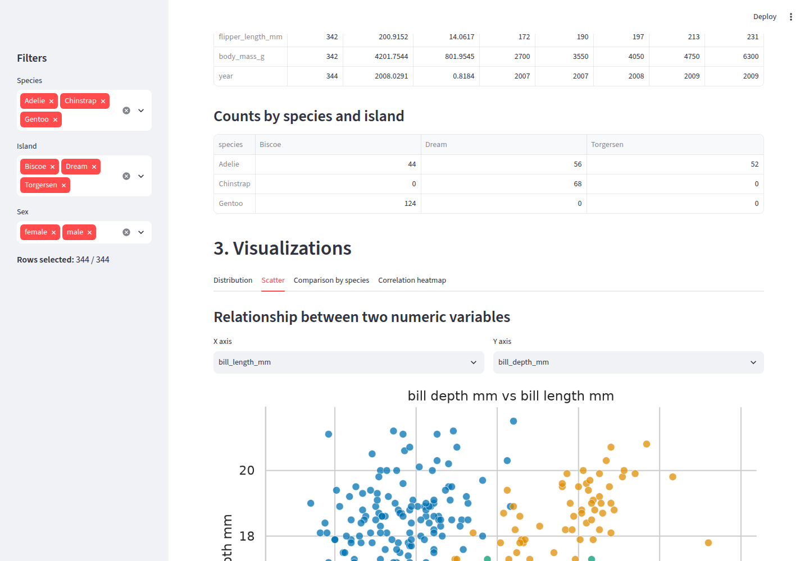
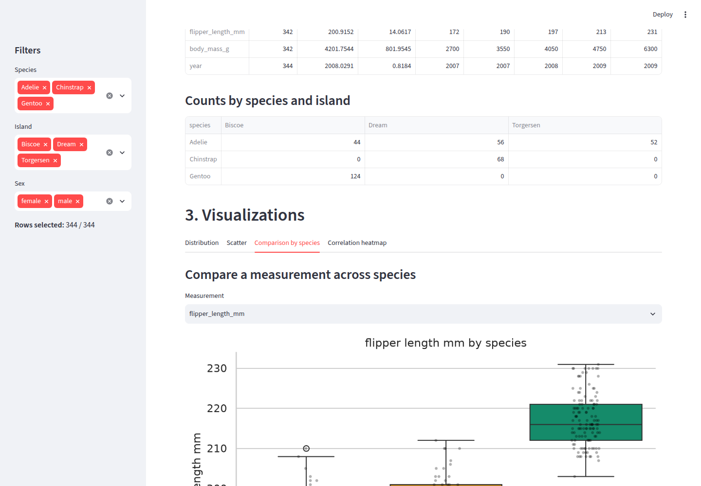
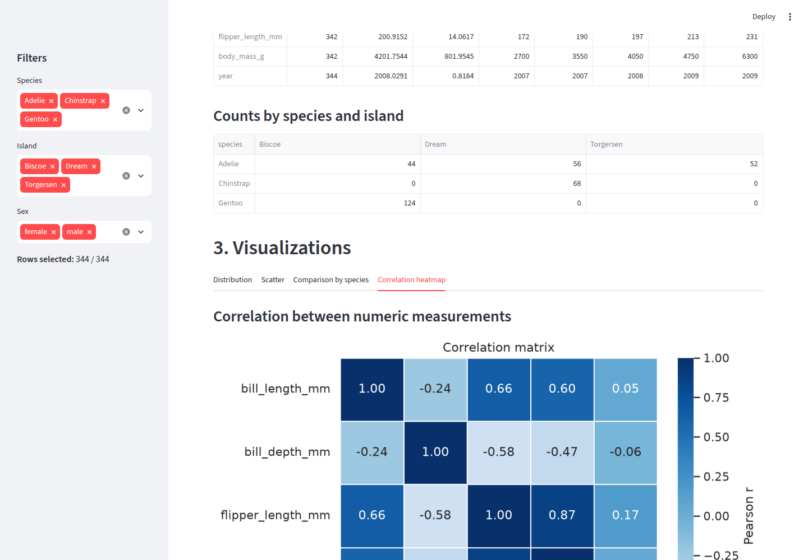

# 🐧 Palmer Penguins — Streamlit EDA App

An interactive exploratory data analysis (EDA) app built with [Streamlit](https://streamlit.io/), exploring the [Palmer Penguins](https://allisonhorst.github.io/palmerpenguins/) dataset — 344 penguins across 3 species, 3 islands in Antarctica's Palmer Archipelago, with body measurements collected between 2007 and 2009.

## What the app does

- Loads `data/penguins.csv` and lets you filter by species, island, and sex
- Shows a data overview: shape, column types, and a missing-values breakdown
- Computes summary statistics and species/island counts
- Renders four interactive charts:
  - **Distribution** — histogram + KDE of any numeric variable, split by species
  - **Scatter** — relationship between any two numeric variables, colored by species
  - **Comparison by species** — box plot (with individual points) of a chosen measurement
  - **Correlation heatmap** — Pearson correlation between all numeric measurements

Species are always colored consistently (a fixed, colorblind-safe palette) no matter which filters are applied.

## Project structure

```
penguins-eda-app/
├── app.py              # Streamlit app
├── data/
│   └── penguins.csv    # Palmer Penguins dataset
├── screenshots/        # Screenshots of the running app (used below)
├── pyproject.toml      # Project metadata + dependencies (managed by uv)
└── README.md
```

## Getting started

This project uses [`uv`](https://docs.astral.sh/uv/) for dependency management.

```bash
# 1. Clone the repository
git clone <your-repo-url>
cd penguins-eda-app

# 2. Install dependencies (creates a .venv automatically)
uv sync

# 3. Run the app
uv run streamlit run app.py
```

The app will open at `http://localhost:8501`.

### Dependencies

- `streamlit` — web app framework
- `pandas` / `numpy` — data loading and manipulation
- `matplotlib` / `seaborn` — charts
- `palmerpenguins` — source of the dataset (exported once to `data/penguins.csv`)

## Dataset

The Palmer Penguins dataset (Gorman, Williams & Fraser, 2020) contains 8 columns:

| Column | Description |
|---|---|
| `species` | Adelie, Chinstrap, or Gentoo |
| `island` | Biscoe, Dream, or Torgersen |
| `bill_length_mm` | Bill length in millimeters |
| `bill_depth_mm` | Bill depth in millimeters |
| `flipper_length_mm` | Flipper length in millimeters |
| `body_mass_g` | Body mass in grams |
| `sex` | male or female |
| `year` | Study year (2007–2009) |

It includes a small number of missing values, which the app surfaces in the "Data overview" section.

## Screenshots

**Data overview**



**Distribution tab**



**Scatter tab**



**Comparison by species tab**



**Correlation heatmap tab**



## Author

Mike ([michaelmayaka7@gmail.com](mailto:michaelmayaka7@gmail.com))
